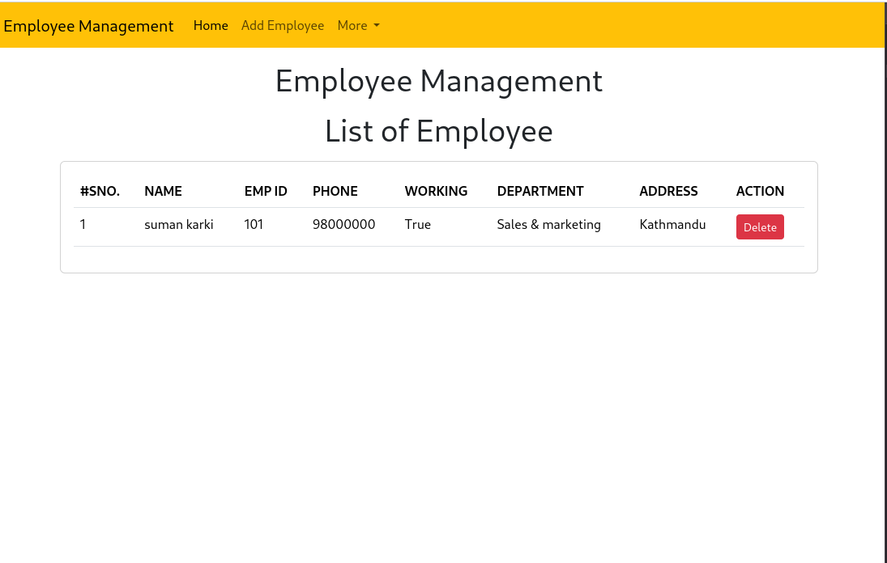

Welcome to my Employee Management project—a journey into understanding the intricacies of database operations in Django. Let me guide you through this simple yet powerful application with some captivating visuals.

Get ready to enhance your team by effortlessly adding new employees!

By simply clicking the "Add Employee" button, you unlock the gateway to expanding your workforce. The process is intuitive, and the application seamlessly guides you through every step.

Once you've added an employee, get ready for the magic! You'll be whisked away to the dynamic realm of the Employee List—a digital database showcasing the heart and soul of your team.

Marvel at the organized collection of team members, each represented with vital details. This visual representation offers a quick overview and makes managing your team a breeze.

Feeling intrigued? Eager to dive in and experience it for yourself? Here's a step-by-step tutorial on how you can run this application on your system:

