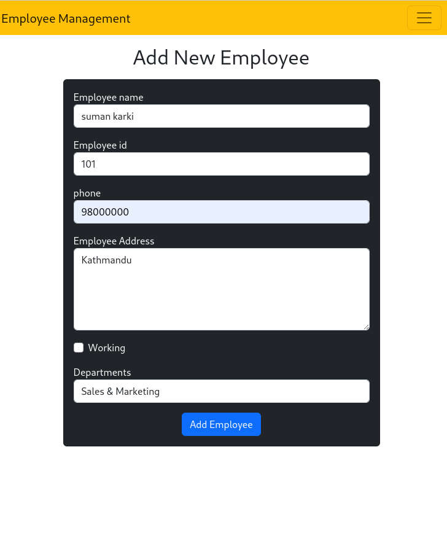

It's a simple Employee Management project. My motive to create this project is to learn about how a database works in Django. Here are some sample pictures of how it works:

you can add employee by click add employee .

after added employee you will automatically redirect to the list of employee(database)

Here's a tutorial on how you can run this app in your system:
